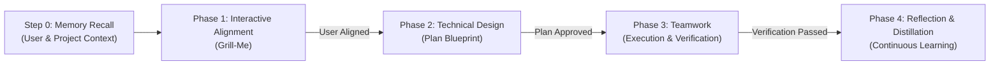

# Grill-Me $\to$ Plan $\to$ Teamwork $\to$ Distill Pipeline (Recursive Memory Engine)

Execute project development across four strictly gated, sequential phases backed by a two-tier recursive memory architecture. **Do not skip or blend phases.** Each phase acts as a prerequisite gate for the subsequent phase. This skill is 100% self-contained and has zero dependencies on external slash commands.



---

## Step 0: Memory Recall (Two-Tier Context Retrieval)

Before initiating Phase 1, inspect and ingest persistent memory documents into context:
1. **Developer Assessment Document (`ASSESSMENT.md`)**:
   - Location: `.grill-plan-team/ASSESSMENT.md` (Project Local) or `~/.config/grill-plan-team/ASSESSMENT.md` (User Global).
   - Ingests: Developer persona, job role, daily tasks, AI experience level, **activation & trigger mode (Automatic vs Explicit only)**, and preferred collaboration style.
2. **Requirements & Guardrails Document (`REQUIREMENTS.md`)**:
   - Location: `.grill-plan-team/REQUIREMENTS.md` (Project Local) or `~/.config/grill-plan-team/REQUIREMENTS.md` (User Global).
   - Ingests: Technical guardrails, safety policies, VCS workflows (`git`, `gh` CLI, GitLab, Bitbucket), preferred languages and libraries, architectural decision records (ADRs), and reviewer pitfall lessons.
3. **Activation Governance**:
   - Check `## Activation & Trigger Preference` in `ASSESSMENT.md`:
     - **Automatic (Default)**: Automatically activate the grill-plan-team workflow whenever the user requests a non-trivial feature, refactor, or architecture change.
     - **Explicit only**: Only activate when the user explicitly invokes `/grill-plan-team` or requests the workflow by name.
4. **Hierarchy & Auto-Migration**:
   - Project-level files take precedence over global user-level files.
   - If legacy `user-memory.md` or `project-memory.md` files exist without the new documents, automatically migrate their contents into `ASSESSMENT.md` and `REQUIREMENTS.md`.

---

## Phase 1: Interactive Alignment (Grill-Me)

Conduct a targeted, adaptive interview with the user to explore and resolve all technical, UX, and architectural decisions before writing any code or plans.

### Execution Rules:

#### 1. Baseline Assessment Onboarding (First-Run & Rerun Trigger)
- **First-Run Detection**: If neither `ASSESSMENT.md` nor `REQUIREMENTS.md` exists (neither in local `.grill-plan-team/` nor in global `~/.config/grill-plan-team/`), or if the user requests a reset (`re-assess`, `update preferences`, `rerun assessment`):
  - Conduct a short 4-question baseline assessment before addressing the immediate task:
    1. **Storage Scope Choice**: Ask where they want to store their baseline preferences:
       - `(Recommended) User Global Scope (~/.config/grill-plan-team/)` — machine-wide defaults for all projects.
       - `Project Local Scope (.grill-plan-team/)` — repository-specific settings for this codebase.
    2. **Trigger Mode**: Ask how the skill should be invoked:
       - `(Recommended) Automatic` — LLM determines when to invoke on non-trivial features or architectural changes.
       - `Explicit only` — only run when explicitly invoked with `/grill-plan-team` or chat prompt.
    3. **Developer Assessment**: Ask for their job role/daily focus and their experience level with AI (Beginner, Intermediate, Advanced, Power User).
    4. **Requirements & Guardrails**: Ask for their guardrails (e.g. zero runtime deps, test protection), VCS workflow (`gh`, `git`, GitLab, Bitbucket), and preferred languages/libraries.
  - Immediately save the baseline files (`ASSESSMENT.md` and `REQUIREMENTS.md`) to the selected location and proceed with the task.
- **Subsequent Runs**: Skip baseline questions automatically and prime all decisions with established preferences.

#### 2. Adaptive Task Alignment
1. **Adaptive Memory Recall**:
   - Skip trivial questions already answered by user preferences or project memory.
   - Ground decisions in established project conventions and historical decisions.
2. **One Question at a Time**:
   - Use the `ask_question` tool for every decision to present structured, clickable multiple-choice options. Keep option labels concise.
   - Never dump multiple separate questions in a single response unless they are grouped in an atomic `ask_question` call.
3. **Always Recommend with Attribution**:
   - Provide your recommended choice for each question, prefixed with `(Recommended)` and accompanied by a concise engineering rationale.
   - Explicitly cite memory when a recommendation stems from established preferences (e.g., `(Recommended) [Option] - [Rationale] (Aligned with user/project memory)`).
4. **Explore the Codebase First**:
   - Before asking a question, search the codebase (using `view_file`, `run_command`, etc.). If existing conventions, configs, or patterns provide the answer, adopt them instead of asking trivial questions.
5. **Walk the Design Tree**:
   - Resolve decisions branch-by-branch (e.g., Data models $\to$ API contract $\to$ State/Storage $\to$ UI/CLI surface $\to$ Edge cases).
6. **Phase Gate Completion**:
   - Phase 1 concludes only when all dependencies, edge cases, scope boundaries, and architectural tradeoffs have been agreed upon.

---

## Phase 2: Technical Design & Verification (Plan)

Translate the agreed design into a rigorous, actionable engineering blueprint grounded in project memory.

### Execution Rules:
1. **Deep Codebase Exploration & Memory Alignment**:
   - Inspect all relevant files, imports, types, database schemas, and existing test suites to ensure 100% feasibility.
   - Honor established conventions, past architectural decisions (ADRs), and known pitfall avoidances found in `.grill-plan-team/project-memory.md`.
2. **Create Implementation Plan Artifact**:
   - Create an implementation plan artifact at `<Artifact Directory>/<feature>_implementation_plan.md` using `write_to_file` with:
     ```json
     {
       "ArtifactMetadata": {
         "RequestFeedback": true,
         "Summary": "Technical design plan and verification strategy for <feature>",
         "UserFacing": true
       }
     }
     ```
   - Structure the plan with:
     - **Goal Description**: 1–2 sentence problem statement and desired end-state.
     - **User Review Required**: Critical breaking changes or architectural constraints agreed in Phase 1.
     - **Proposed Changes**: Files to create, modify, or delete, grouped by component/layer with code snippets and diffs.
     - **Verification Plan**: Objective, programmatic verification steps (e.g., exact test commands, `tsc --noEmit`, build commands, or E2E scripts).
3. **Phase Gate Approval**:
   - Present the plan artifact link to the user.
   - **Do not proceed to execution or Phase 3 until the user explicitly approves the plan** (e.g., "looks good", "approved", "proceed").

---

## Phase 3: Teamwork Execution & Verification

Package the approved blueprint into a high-leverage specification and execute autonomously with rigorous programmatic verification.

### Execution Rules:

#### 1. Maintain the Prompt Draft Artifact
Create and update `prompt_draft.md` in the artifact directory (`<Artifact Directory>/prompt_draft.md`) using this structure:

```markdown
# Execution Prompt — Draft

> Status: Ready for launch — awaiting user approval
> Goal: Craft prompt → get user approval → execute with verification
> Execution mode: Autonomous execution with programmatic verification

[Project description — 1-2 sentences]

Working directory: <Target absolute path>
Integrity mode: development

## Requirements

### R1. [Primary Deliverable]
[What to build, focus on behavior and interfaces]

### R2. [Secondary Deliverable / Constraint]
...

## Acceptance Criteria

### [Verification Category]
- [ ] [Objective, programmatic condition: e.g. test command passes with zero errors]
- [ ] [Strict type checking passes: e.g. npx tsc --noEmit]
- [ ] [Build passes: e.g. npm run build]
- [ ] [Git governance: e.g. work committed only to local branch, zero pushes/deploys]

---
*Next: when approved → proceed to execution*
```

#### 2. Adhere to Teamwork Principles
- **Specify What, Not How**: Define clear interfaces, behaviors, and acceptance criteria. Avoid over-constraining the agent team with rigid implementation micro-steps unless the user specifically requested them.
- **Objective Verification**: Provide programmatic verification commands that prevent premature self-certification of work.
- **Minimal Requirements**: Only specify constraints the user genuinely cares about, leaving room for independent problem-solving.

#### 3. Universal Execution Protocol
Once the user approves ("launch", "go", "proceed", or auto-approved):
1. Update `prompt_draft.md` status to `> Status: Launched & Executing`.
2. **For Multi-Agent Platforms (e.g. Antigravity)**:
   - If the harness provides a subagent delegation tool (such as `invoke_subagent`), delegate execution to an autonomous subagent:
     ```json
     {
       "Subagents": [
         {
           "TypeName": "self",
           "Role": "Execution Orchestrator",
           "Prompt": "<Full prompt text extracted from prompt_draft.md>",
           "Model": "inherit"
         }
       ]
     }
     ```
    - In environments where a specialized swarm orchestrator is pre-configured, that type may also be used.
3. **For Single-Agent Harnesses (Claude Code, Cursor, Windsurf, Roo Code, Kimi Code, Hermes Agent, Pi Agent, Oh My Pi, OpenCode, Codex, Grok Build)**:
   - Execute the approved plan directly as the lead orchestrator:
     - Decompose the requirements into discrete steps.
     - Implement code changes and immediately run objective verification commands (`npm test`, `tsc`, linters).
     - Never bypass, weaken, or mock tests to achieve a passing state.
     - Provide a final verification summary listing verified vs unverified criteria.

---

## Phase 4: Reflection & Distillation Loop

Automatically execute this post-execution learning loop immediately after Phase 3 verification passes to persist learnings into the two categories: **User** and **Project**.

### Distillation Protocol:
1. **Update `ASSESSMENT.md` (Developer Profile & Collaboration Preferences)**:
   - Record explicit developer preferences, communication style feedback, and workflow adjustments under `## Distilled User Preferences`.
2. **Update `REQUIREMENTS.md` (Technical Decisions, Guardrails & Lessons)**:
   - **Architectural Records**: Append new design decisions and constraints under `## Architectural Decision History`. Format: `- [YYYY-MM-DD - Feature/Component]: [Decision summary and core rationale]`.
   - **Preventative Lessons**: Record test failures, bugs, edge cases, and reviewer lessons under `## Past Pitfalls & Reviewer Lessons`. Format: `- [Pitfall Category]: [Concrete lesson and prevention heuristic]`.
   - **Guardrails & Stack**: Update language/library or VCS workflow rules if modified during the project.
3. **Scope Targeting**:
   - Update `.grill-plan-team/REQUIREMENTS.md` for project-level decisions, or `~/.config/grill-plan-team/` for global developer overrides.
4. **Bloat Prevention & Deduplication**:
   - Keep bullet points dense, actionable, and non-redundant. Merge or refine related points instead of appending duplicates.

---

## Uninstallation & Removal Protocol

If the user asks to `remove` or `uninstall` this workflow/skill (e.g. `uninstall /grill-plan-team`, `remove /grill-plan-teams`, or `uninstall https://github.com/tysongoulding/grill-plan-team`):
1. Execute uninstallation:
   ```bash
   node <repo-root>/bin/install.js --uninstall
   # or with npx:
   npx grill-plan-team uninstall
   ```
   Add `--purge` to delete persistent memory/profile files if requested.
2. Alternatively, remove the installed skill directory:
   - **Antigravity**: Delete `~/.gemini/config/plugins/grill-plan-team`
   - **Claude Code**: Delete `~/.claude/skills/grill-plan-team` and `~/.claude/commands/grill-plan-team.md`
   - **Cursor**: Delete `~/.cursor/rules/grill-plan-team.mdc`, `~/.cursorrules`, and `~/.cursor/skills/grill-plan-team`
   - **Windsurf**: Delete `.windsurfrules`
   - **Roo Code**: Delete `.roomodes` and `.clinerules`
   - **Kimi Code**: Delete `~/.kimi/skills/grill-plan-team`
   - **Hermes Agent**: Delete `~/.hermes/skills/grill-plan-team`
   - **Pi Agent**: Delete `~/.pi/agent/skills/grill-plan-team`
   - **Oh My Pi**: Delete `~/.omp/skills/grill-plan-team`
   - **OpenCode**: Delete `~/.config/opencode/skills/grill-plan-team`
   - **Codex**: Delete `~/.codex/skills/grill-plan-team`
   - **Grok Build**: Delete `~/.grok/skills/grill-plan-team`
   - **Universal Local**: Delete `.agents/skills/grill-plan-team`
3. Provide a clear confirmation to the user once removed.
