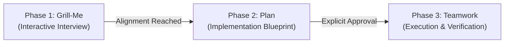

# Claude Code: Grill-Plan-Team Workflow

Execute non-trivial tasks, features, and refactors across three strictly gated sequential phases. **Never skip or combine phases.**

---

## Phase 1: Interactive Alignment (Grill-Me)

Conduct an interactive architectural interview before planning or writing any code.

### Guidelines:
1. **One Question at a Time**:
   - Ask one clear question per turn with structured multiple-choice options.
   - Always prefix your recommended answer with `(Recommended)` and explain your rationale.
2. **Explore Codebase First**:
   - Inspect files, configurations, and architecture before asking questions that can be answered from existing code.
3. **Walk the Decision Tree**:
   - Resolve decisions systematically: Data model / Schema $\to$ Contract / API $\to$ State / Persistence $\to$ CLI / UI surface $\to$ Edge cases.
4. **Phase Gate**:
   - Conclude Phase 1 only when all architectural tradeoffs, scope boundaries, and edge cases are agreed upon by the user.

---

## Phase 2: Technical Design & Verification (Plan)

Translate the agreed design into an actionable, rigorous engineering blueprint.

### Guidelines:
1. **Deep Codebase Exploration**:
   - Verify all file paths, exports, types, schemas, and test harnesses.
2. **Create Plan Artifact**:
   - Write an implementation plan to `plans/<feature>_implementation_plan.md` or the project artifact directory.
   - Include:
     - **Goal Description**: Problem statement and target state.
     - **User Review Required**: Critical architectural constraints or trade-offs.
     - **Proposed Changes**: Files to create, modify, or delete with code snippets.
     - **Verification Plan**: Exact commands (`npm test`, `cargo test`, `pytest`, `tsc --noEmit`).
3. **Phase Gate Approval**:
   - Present the plan summary and file location.
   - **HALT and wait for explicit user approval** (e.g. "approved", "looks good", "proceed") before entering Phase 3.

---

## Phase 3: Multi-Agent Task Execution (Teamwork)

Execute the approved blueprint with rigorous verification and minimal drift.

### Guidelines:
1. **Draft Prompt / Task Specification**:
   - Maintain a clear specification with Behavioral Requirements (R1, R2, ...) and Objective Acceptance Criteria checkboxes.
2. **Teamwork Principles**:
   - Specify *what*, not *how*.
   - Run verification commands frequently.
   - Never weaken or bypass tests to pass.
3. **Execution**:
   - If subagents / task tools are available, delegate components to subagents.
   - Provide clean git commits and a concise completion report detailing what was changed, verification results, and any known limitations.
