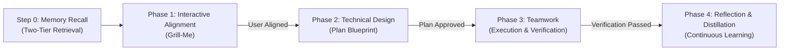

# AGENTS.md — Grill-Plan-Team Agent Guide & Workflow Governance

This document provides definitive instructions for AI coding agents (Antigravity, Claude Code, Cursor, Windsurf, Roo Code / Cline) installing, configuring, and operating within this repository.

---

## 1. Agent Installation Guide (When User Requests "Install this skill / repository")

If the user prompts:
> *"install https://github.com/tysongoulding/grill-plan-team"* or *"install this skill"*

Follow this automated installation protocol:

### Agent Instructions
1. **Do NOT run `npm test` as an install step.** Tests are for CI and repository development, not for end-user installation.
2. **Do NOT run `npm install`.** This package has **zero external runtime dependencies** and runs with vanilla Node.js or POSIX bash.
3. **Execute the Universal Installer** for the user's active environment:

```bash
# Auto-detect host harness and install globally (recommended):
node bin/install.js

# Or using POSIX bash:
./install.sh
```

### Explicit Harness Installation Matrix
If you know your specific runtime environment, run the targeted installer command:

| Harness / Tool | Target Directory | Recommended Install Command |
|---|---|---|
| **Antigravity / Gemini CLI** | `~/.gemini/config/plugins/grill-plan-team` | `node bin/install.js --harness antigravity` |
| **Claude Code** | `~/.claude/skills` & `~/.claude/commands` | `node bin/install.js --harness claude` |
| **Cursor** | `~/.cursor/rules` & `.cursorrules` | `node bin/install.js --harness cursor` |
| **Windsurf** | `.windsurfrules` | `node bin/install.js --harness windsurf` |
| **Roo Code / Cline** | `.roomodes` & `.clinerules` | `node bin/install.js --harness roo` |
| **All Harnesses** | Global across all installed harnesses | `node bin/install.js --all` |

> [!NOTE]
> **Cursor Installation Note**: Cursor indexes rules from `~/.cursor/rules/grill-plan-team.mdc` and `.cursorrules`. To avoid duplicate entries in the slash/skills palette, do not simultaneously copy files into both `~/.cursor/skills/` and `~/.claude/commands/`.

### Local / Project-Level Installation
To install into the current repository instead of user global configuration:
```bash
node bin/install.js --local .
# or: ./install.sh --local .
```

### Baseline Memory Initialization
After installing, initialize developer assessment and guardrails:
```bash
node bin/install.js assess --user
```

---

## 2. Agent Uninstallation Guide (When User Requests "Uninstall" or "Remove")

If the user prompts in chat:
> *"uninstall https://github.com/tysongoulding/grill-plan-team"*  
> *"remove https://github.com/tysongoulding/grill-plan-team"*  
> *"uninstall /grill-plan-team"* or *"uninstall /grill-plan-teams"*  
> *"remove /grill-plan-team"* or *"remove /grill-plan-teams"*  

Follow this automated uninstallation protocol:

### Agent Instructions
1. **Execute the Universal Uninstaller**:
```bash
# Clean uninstall for current harness:
node bin/install.js --uninstall

# Or across all harnesses:
node bin/install.js --all --uninstall

# If the user explicitly asks to purge memory/assessment files:
node bin/install.js --all --uninstall --purge
```

2. **Or Remove Harness Files Directly** (if repository is not locally cloned):
- **Antigravity / Gemini CLI**: Remove `~/.gemini/config/plugins/grill-plan-team`
- **Claude Code**: Remove `~/.claude/skills/grill-plan-team` and `~/.claude/commands/grill-plan-team.md`
- **Cursor**: Remove `~/.cursor/rules/grill-plan-team.mdc`, `~/.cursorrules`, and `~/.cursor/skills/grill-plan-team`
- **Windsurf**: Remove `.windsurfrules`
- **Roo Code / Cline**: Remove `.roomodes` and `.clinerules`
- **Memory files (only if purge requested)**: Remove `~/.config/grill-plan-team`

3. **Confirm completion** to the user with a concise summary of cleaned paths.

---

## 3. Universal Workflow Governance: Grill-Plan-Team

When operating within this repository or when executing tasks under the `grill-plan-team` workflow, all agents must adhere to the 4 gated phases: **Grill-Me $\to$ Plan $\to$ Teamwork $\to$ Distill**.



### Strict Phase Governance

#### Step 0: Memory Recall (Pre-Flight Context)
- Ingest developer assessment from `.grill-plan-team/ASSESSMENT.md` (Project Local) or `~/.config/grill-plan-team/ASSESSMENT.md` (User Global).
- Ingest requirements & guardrails from `.grill-plan-team/REQUIREMENTS.md` (Project Local) or `~/.config/grill-plan-team/REQUIREMENTS.md` (User Global).
- Check `Activation & Trigger Preference`. If set to `Explicit only`, only run when explicitly invoked. If `Automatic`, auto-trigger for non-trivial features or refactors.

#### Phase 1: Interactive Alignment (Grill-Me)
- Resolve all technical, UX, and architectural decisions before writing code or plans.
- If baseline documents are missing, prompt for baseline assessment onboarding.
- Present concise multiple-choice options (`ask_question` tool where available).
- Always prefix recommended options with `(Recommended)` and provide concise rationale.
- Walk the design tree: Data models $\to$ API contract $\to$ State/Storage $\to$ CLI surface $\to$ Edge cases.

#### Phase 2: Technical Design & Verification (Plan)
- Inspect imports, types, schemas, and existing tests to ensure 100% feasibility.
- Write an implementation plan artifact containing: Goal Description, User Review Required, Proposed Changes, and an objective Verification Plan.
- **Stop and wait for user approval.** Do not proceed to execution until approved.

#### Phase 3: Teamwork Execution & Verification
- Maintain prompt draft artifact with behavioral requirements (R1, R2, ...) and objective acceptance criteria.
- Execute autonomously upon user approval. On multi-agent harnesses, delegate using subagent tools (e.g. `invoke_subagent`). On single-agent harnesses, execute directly as lead orchestrator.
- Run programmatic tests to verify all acceptance criteria.

#### Phase 4: Reflection & Distillation Loop
- Persist learnings from interview choices, architectural outcomes, and test results into `ASSESSMENT.md` and `REQUIREMENTS.md`.
- Anti-bloat rule: Enforce concise, deduplicated bullet points.
