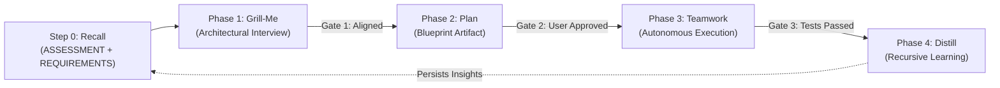

# grill-plan-team

[](https://github.com/tysongoulding/grill-plan-team/actions/workflows/ci.yml)
[](https://opensource.org/licenses/MIT)
[](https://github.com/tysongoulding/grill-plan-team/releases)
[](https://nodejs.org/)

> **A self-contained, recursive gated workflow plugin with two-tier memory for AI coding agents.**  
> Zero external runtime dependencies. Works seamlessly across 12 harnesses: **Antigravity / Gemini CLI**, **Claude Code**, **Cursor**, **Windsurf**, **Roo Code / Cline**, **Kimi Code**, **Hermes Agent**, **Pi Agent**, **Oh My Pi**, **OpenCode**, **Codex**, and **Grok Build**.

---

## 1. What It Solves

Most AI coding assistants suffer from three critical failure modes when given non-trivial coding tasks:
1. **Premature Implementation**: Agents jump directly into editing code before clarifying ambiguous requirements, causing regressions, architectural mismatches, and wasted iterations.
2. **Context Amnesia**: Every new session starts from scratch. The agent forgets your technical guardrails, preferred tooling (e.g. `gh` CLI vs web UI), coding standards, and past reviewer lessons.
3. **Unchecked Swarms**: Autonomous task workers wander off-spec without strict, programmatic verification gates.

`grill-plan-team` eliminates these problems by enforcing a **strictly gated, recursive development lifecycle** backed by persistent memory.

---

## 2. How It Solves It

The workflow executes four deterministic phases, learning continuously across tasks:



### The 4 Gated Phases
- **Step 0: Memory Recall**: Before touching code or asking questions, the agent reads:
  - `ASSESSMENT.md`: Your developer persona, job role, AI experience level (at top), trigger mode (Automatic vs Explicit), and communication habits.
  - `REQUIREMENTS.md`: Hard guardrails (zero runtime deps, test protection), VCS workflows (`gh`, `git`), preferred languages, and past architectural decision records (ADRs).
- **Phase 1: Interactive Alignment (`Grill-Me`)**: Resolves architectural choices **one decision at a time** using structured multiple-choice questions with clear `(Recommended)` rationales. Explores existing codebase patterns first to avoid asking obvious questions.
- **Phase 2: Technical Design (`Plan`)**: Synthesizes the agreed architecture into a formal implementation blueprint artifact with exact file diffs and objective verification commands. **Halts execution until you explicitly approve.**
- **Phase 3: Teamwork Execution (`Teamwork`)**: Converts the approved blueprint into actionable requirements and executes autonomously with strict programmatic verification (`npm test`, typecheck). Never weakens or bypasses tests.
- **Phase 4: Reflection & Distillation Loop (`Distill`)**: Automatically distills decisions, overrides, and reviewer bug lessons back into `ASSESSMENT.md` and `REQUIREMENTS.md` so the agent gets smarter and more aligned over time.

---

## 3. Why It's Important

- **Zero Hallucinated Architectures**: Alignment happens before code is written, ensuring the design matches your exact system boundaries.
- **Continuous Personalization**: The agent remembers your habits, preferred runtimes, and reviewer feedback across sessions without prompt engineering.
- **Deterministic Quality Gate**: Execution cannot proceed without explicit plan approval, and completion cannot occur without passing programmatic tests.
- **100% Standalone**: Zero external npm runtime dependencies. Pure Node.js and POSIX shell. Works across all major agent harnesses with identical behavior.

---

## 4. How & When to Use

### When to Use This Skill
- **New Features & End-to-End Tasks**: When building new modules, endpoints, or services requiring clear design contracts.
- **Refactors & Migrations**: When restructuring codebases, updating dependencies, or redesigning schemas without breaking existing behavior.
- **Multi-Agent Swarm Tasks**: When orchestrating complex tasks that need formal acceptance criteria and objective verification.

### How to Use It

#### Automatic vs Explicit Trigger Modes
During your first baseline assessment, you choose how the skill is triggered (saved in `ASSESSMENT.md`):
- **Automatic (Recommended)**: The LLM detects when a task involves non-trivial architecture, new features, or multi-file refactors, and automatically initiates the workflow.
- **Explicit Only**: The agent only enters the workflow when you explicitly invoke it.

#### Activation by Harness
- **Antigravity / Gemini CLI**: Runs automatically based on task complexity or skill selection.
- **Claude Code**: Type `/grill-plan-team <task or feature description>`.
- **Cursor**: Automatically loaded via `.cursorrules` and `.cursor/rules/grill-plan-team.mdc`.
- **Windsurf**: Cascade auto-evaluates via `.windsurfrules`.
- **Roo Code / Cline**: Select the **Grill-Plan-Team** mode from the UI dropdown.
- **Kimi Code**: Auto-loaded from `~/.kimi/skills/grill-plan-team` or `.agents/skills/grill-plan-team`.
- **Hermes Agent**: Auto-loaded from `~/.hermes/skills/grill-plan-team` or `.agents/skills/grill-plan-team`.
- **Pi Agent**: Loaded from `~/.pi/agent/skills/grill-plan-team` or `.agents/skills/grill-plan-team`.
- **Oh My Pi**: Loaded from `~/.omp/skills/grill-plan-team` or `.agents/skills/grill-plan-team`.
- **OpenCode**: Auto-loaded from `~/.config/opencode/skills/grill-plan-team` or `.agents/skills/grill-plan-team`.
- **Codex**: Auto-loaded from `~/.codex/skills/grill-plan-team` or `.agents/skills/grill-plan-team`.
- **Grok Build**: Auto-loaded from `~/.grok/skills/grill-plan-team` or `.agents/skills/grill-plan-team`.

#### Rerun Assessment Anytime
You can update your profile, guardrails, or trigger mode anytime:
```bash
# In chat:
"re-assess" or "update preferences"

# From terminal:
npx grill-plan-team assess [--user | --project]
./install.sh assess [--user | --project]
```

---

## 5. Simple Installation & Uninstallation

### Simple Installation

#### In Agent Chat (All 12 Supported Harnesses)
Simply paste this prompt into your agent's chat:
```text
install https://github.com/tysongoulding/grill-plan-team
```
The agent reads [`AGENTS.md`](AGENTS.md) and executes the zero-dependency installer for your active environment.

#### From Terminal
```bash
# One-line universal installer
npx grill-plan-team

# Or via curl:
curl -fsSL https://raw.githubusercontent.com/tysongoulding/grill-plan-team/main/install.sh | bash

# Local repository install
npx grill-plan-team --local .
```

---

### Simple Uninstallation

#### In Agent Chat
Simply prompt the agent in chat:
```text
uninstall /grill-plan-team
# or:
remove /grill-plan-team
# or:
uninstall https://github.com/tysongoulding/grill-plan-team
# or:
remove https://github.com/tysongoulding/grill-plan-team
```
*(Also recognizes plural `/grill-plan-teams`)*.

#### From Terminal
```bash
# Clean uninstallation across all detected harnesses:
npx grill-plan-team uninstall
# or:
npx grill-plan-team remove

# To also purge persistent memory and profile files:
npx grill-plan-team uninstall --purge

# Shell script equivalent:
./install.sh uninstall [--purge]
```

### Memory CLI

```bash
# Display memory file paths
npx grill-plan-team memory path assessment --user
npx grill-plan-team memory path requirements --project

# View current memory
npx grill-plan-team memory show assessment --user
npx grill-plan-team memory show requirements --project

# Initialize memory files
npx grill-plan-team memory init [--project]
```

---

## License

[MIT](LICENSE) © 2026 Tyson Goulding
