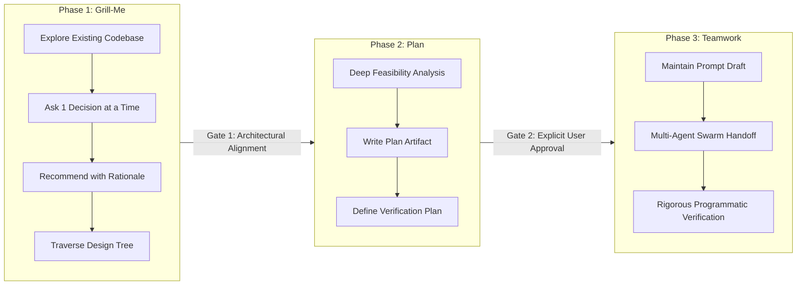

# grill-plan-team

[](https://github.com/tysongoulding/grill-plan-team/actions/workflows/ci.yml)
[](https://opensource.org/licenses/MIT)
[](https://github.com/tysongoulding/grill-plan-team/releases)
[](https://nodejs.org/)

> **A 3-phase gated workflow plugin for autonomous AI coding agents:**  
> **Grill-Me** (interactive design alignment) $\to$ **Plan** (technical blueprint artifact) $\to$ **Teamwork** (multi-agent execution & verification).

Cross-harness plugin and installer support for **Antigravity / Gemini CLI**, **Claude Code**, **Cursor**, **Windsurf**, and **Roo Code / Cline**.

---

## The 3-Phase Gated Architecture

Most AI coding agents fail on complex tasks when they jump directly from a prompt into modifying code. `grill-plan-team` prevents premature coding by enforcing three strictly sequential, gated phases:



### Phase 1: Interactive Alignment (`Grill-Me`)
- **Explore Codebase First**: Deeply search the codebase before asking questions. If existing conventions answer a question, adopt them.
- **One Question at a Time**: Never overwhelm the user with multiple questions at once. Use structured multiple-choice decisions.
- **Always Recommend**: Prefix recommended options with `(Recommended)` and provide a concise engineering rationale.
- **Walk the Decision Tree**: Systematically resolve Data models $\to$ API contract $\to$ State/Storage $\to$ CLI/UI surface $\to$ Edge cases.
- **Gate 1**: Conclude only when all architectural tradeoffs and scope boundaries are agreed upon.

### Phase 2: Technical Design & Verification (`Plan`)
- **Implementation Plan Artifact**: Save a formal engineering blueprint (`<feature>_implementation_plan.md`) with:
  1. Goal Description (1–2 sentences).
  2. User Review Required (breaking changes, critical tradeoffs).
  3. Proposed Changes (files to create, modify, delete with diffs).
  4. Objective Verification Plan (exact test commands, typechecks, build commands).
- **Gate 2**: **HALT execution.** Do NOT write or modify code until the user explicitly reviews and approves the plan.

### Phase 3: Multi-Agent Swarm Handoff (`Teamwork`)
- **Prompt Draft Artifact**: Package the approved plan into `prompt_draft.md` with behavioral requirements (R1, R2, ...) and objective acceptance criteria checkboxes.
- **Specify What, Not How**: Give agents high-leverage boundaries without micromanaging implementation details.
- **Autonomous Delegation**: Handoff execution to the multi-agent swarm (`invoke_subagent` in Antigravity or native harness subagents).
- **Rigorous Verification**: Run objective test suites. Never weaken tests to pass. Distinguish verified from unverified aspects.

---

## Cross-Harness Support Matrix

| Harness | Scope | Target Path | Activation Trigger |
| :--- | :--- | :--- | :--- |
| **Antigravity / Gemini CLI** | Global / Local | `~/.gemini/config/plugins/grill-plan-team`<br/>`rules/AGENTS.md`<br/>`skills/grill-plan-team/SKILL.md` | Skill selection, `plugin.json` registry |
| **Claude Code** | Global / Local | `~/.claude/skills/grill-plan-team/SKILL.md`<br/>`~/.claude/commands/grill-plan-team.md` | `/grill-plan-team [feature]` |
| **Cursor** | Global / Local | `~/.cursorrules`<br/>`~/.cursor/rules/grill-plan-team.mdc` | Automatic rule activation (`.cursorrules` & MDC) |
| **Windsurf** | Global / Local | `~/.windsurfrules` | Cascade auto-evaluates on planning/features |
| **Roo Code / Cline** | Global / Local | `~/.roomodes`<br/>`~/.clinerules` | Mode dropdown: **Grill-Plan-Team** |

---

## Quick-Start Installation

Zero runtime dependencies. You can install via `curl`, `npx`, or local clone:

### 1. One-Line Curl Installer (Recommended)
```bash
curl -fsSL https://raw.githubusercontent.com/tysongoulding/grill-plan-team/main/install.sh | bash
```

### 2. Node / NPX
```bash
npx grill-plan-team
```

### 3. Local Project Installation
To install rules and adapters directly into your current project repository:
```bash
# Using install.sh
./install.sh --local .

# Or using npx
npx grill-plan-team --local .
```

---

## CLI Options

Both `install.sh` and `npx grill-plan-team` support identical options:

```text
Options:
  --global, -g          Install to user-level global configuration directories (default)
  --local, -l [path]    Install to project repository at [path] (default: current directory)
  --all, -a             Install to all supported harnesses regardless of host detection
  --harness <name>      Target specific harness(es): antigravity, claude, cursor, windsurf, roo
  --uninstall, -u       Cleanly remove installed grill-plan-team configurations
  --dry-run, -d         Preview changes without modifying the filesystem
  --interactive         Prompt for target harnesses interactively
  --help, -h            Show help documentation
```

### Examples

```bash
# Auto-detect and install to detected harnesses globally
npx grill-plan-team

# Force install across all harnesses into current project
npx grill-plan-team --local . --all

# Install only for Claude Code and Cursor
npx grill-plan-team --harness claude,cursor

# Dry-run preview
npx grill-plan-team --dry-run

# Clean uninstallation
npx grill-plan-team --uninstall
```

---

## Harness Usage

### Antigravity / Gemini CLI (`agy`)
Run your agent task normally. The agent automatically references `rules/AGENTS.md` and `skills/grill-plan-team/SKILL.md` to gate every non-trivial task through Phase 1 $\to$ Phase 2 $\to$ Phase 3.

### Claude Code
Run the slash command:
```bash
/grill-plan-team Add OAuth2 GitHub authentication flow
```
Claude Code will start Phase 1 (Grill-Me), interview you on technical choices, output the plan artifact for approval, and then execute Phase 3.

### Cursor
Cursor automatically loads `.cursor/rules/grill-plan-team.mdc` and `.cursorrules`. Simply prompt Composer or Chat:
```text
Implement user authentication according to grill-plan-team.
```

### Windsurf
Cascade detects `.windsurfrules` and enforces the sequential interview $\to$ blueprint $\to$ execution lifecycle.

### Roo Code / Cline
Select the **Grill-Plan-Team** mode from the mode selector dropdown in the Roo Code UI.

---

## Development & Testing

Run the test suite:

```bash
# Verify shell installer syntax
bash -n install.sh

# Run comprehensive Node test suite (0 dependencies)
npm test
```

---

## License

[MIT](LICENSE) © 2026 Tyson Goulding
