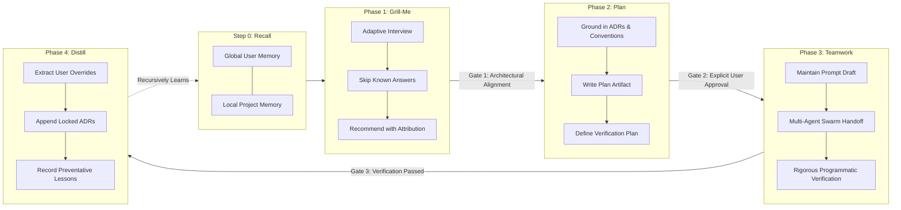

# grill-plan-team

[](https://github.com/tysongoulding/grill-plan-team/actions/workflows/ci.yml)
[](https://opensource.org/licenses/MIT)
[](https://github.com/tysongoulding/grill-plan-team/releases)
[](https://nodejs.org/)

> **A self-contained, recursive gated workflow plugin with two-tier memory for autonomous AI coding agents:**  
> **Step 0: Memory Recall** $\to$ **Phase 1: Interactive Alignment** $\to$ **Phase 2: Technical Blueprint** $\to$ **Phase 3: Autonomous Execution** $\to$ **Phase 4: Reflection & Distillation**.  
> Fully standalone with zero external runtime dependencies.

Cross-harness plugin and installer support for **Antigravity / Gemini CLI**, **Claude Code**, **Cursor**, **Windsurf**, and **Roo Code / Cline**.

---

## The Recursive Gated Architecture

Most AI coding agents fail on complex tasks when they jump directly from a prompt into modifying code, repeating past mistakes and forgetting developer preferences. `grill-plan-team` solves this with a two-tier recursive memory architecture and four gated lifecycle phases:



### Step 0: Pre-Flight Memory Recall
Before asking any questions or modifying files, the agent automatically ingests context from persistent memory:
- **Global User Memory (`-user`)**: Identifies personal developer preferences, preferred tech stacks (e.g. zero runtime dependencies, native test runners), architectural heuristics, and interaction style.
- **Local Project Memory (`-per-project`)**: Identifies repository conventions, domain terminology, historical architectural decisions (ADRs), and past reviewer pitfall lessons.

### Phase 1: Interactive Alignment (`Grill-Me`)
- **Adaptive Memory Recall**: Trivial questions already resolved in memory are skipped.
- **One Question at a Time**: Avoids overwhelming the user by presenting structured multiple-choice decisions one at a time.
- **Always Recommend with Attribution**: Prefixes recommended options with `(Recommended)` and provides concise engineering rationales, explicitly citing memory when recommendations align with established preferences.
- **Walk the Decision Tree**: Systematically resolves Data models $\to$ API contract $\to$ State/Storage $\to$ CLI/UI surface $\to$ Edge cases.
- **Gate 1**: Concludes only when all architectural tradeoffs, scope boundaries, and edge cases are agreed upon.

### Phase 2: Technical Design & Verification (`Plan`)
- **Memory-Grounded Blueprint**: Builds on established project conventions and respects past architectural decisions (ADRs) and pitfall avoidance lessons.
- **Implementation Plan Artifact**: Saves a formal engineering blueprint (`<feature>_implementation_plan.md`) with:
  1. Goal Description (1–2 sentences).
  2. User Review Required (critical tradeoffs, breaking changes).
  3. Proposed Changes (files to create, modify, delete with diffs).
  4. Objective Verification Plan (exact test commands, typechecks, build commands).
- **Gate 2**: **HALT execution.** Do NOT write or modify code until the user explicitly reviews and approves the plan.

### Phase 3: Multi-Agent Swarm Handoff (`Teamwork`)
- **Prompt Draft Artifact**: Packages the approved plan into `prompt_draft.md` with behavioral requirements (R1, R2, ...) and objective acceptance criteria checkboxes.
- **Specify What, Not How**: Gives agents high-leverage boundaries without micromanaging implementation details.
- **Autonomous Delegation**: Handoffs execution to the multi-agent swarm (`invoke_subagent` in Antigravity or native harness subagents).
- **Rigorous Verification**: Runs objective test suites. Never weakens or deletes tests to pass. Distinguishes verified from unverified aspects.

### Phase 4: Reflection & Distillation Loop (`Distill`)
Runs autonomously immediately after Phase 3 verification passes:
1. **User Preferences**: Distills user choices and explicit overrides made during the interview into `~/.config/grill-plan-team/user-memory.md`.
2. **Architectural Decision Records (ADRs)**: Appends newly locked architectural decisions to `.grill-plan-team/project-memory.md` under `## Architectural Decision History`.
3. **Pitfall Avoidance**: Records actionable preventative lessons for bugs or edge cases uncovered during execution under `## Past Pitfalls & Reviewer Lessons`.
4. **Anti-Bloat**: Enforces concise, deduplicated bullet points so memory stays high-signal and lightweight over time.

---

## Two-Tier Memory Storage

| Scope | Location | Primary Contents |
| :--- | :--- | :--- |
| **Global User Memory (`-user`)** | `~/.config/grill-plan-team/user-memory.md`<br/>*(or `$XDG_CONFIG_HOME/grill-plan-team/user-memory.md`)* | Developer profile, stack habits, test runner choices, architectural heuristics |
| **Local Project Memory (`-per-project`)** | `.grill-plan-team/project-memory.md` | Archetype, domain terms, repo conventions, Architectural Decision Records (ADRs), pitfall lessons |

Both memory files are clean, human-readable markdown with standardized headers, making them easy to inspect, version-control, or hand-edit at any time.

---

## Memory CLI Commands

`grill-plan-team` provides dedicated CLI commands to inspect and manage two-tier memory files:

```bash
# Display filesystem paths to memory files
npx grill-plan-team memory path --user
# => ~/.config/grill-plan-team/user-memory.md

npx grill-plan-team memory path --project
# => /path/to/project/.grill-plan-team/project-memory.md

# Initialize memory files with standard markdown sections
npx grill-plan-team memory init           # Initializes global user memory
npx grill-plan-team memory init --project # Initializes local project memory

# View memory content directly in the terminal
npx grill-plan-team memory show --user
npx grill-plan-team memory show --project
```

Both `npx grill-plan-team` and `./install.sh` support these memory subcommands identically.

---

## Cross-Harness Support Matrix

| Harness | Scope | Target Path | Activation Trigger |
| :--- | :--- | :--- | :--- |
| **Antigravity / Gemini CLI** | Global / Local | `~/.gemini/config/plugins/grill-plan-team`<br/>`rules/AGENTS.md`<br/>`skills/grill-plan-team/SKILL.md` | Skill selection, `plugin.json` registry |
| **Claude Code** | Global / Local | `~/.claude/skills/grill-plan-team/SKILL.md`<br/>`~/.claude/commands/grill-plan-team.md` | `/grill-plan-team [feature]` |
| **Cursor** | Global / Local | `~/.cursorrules`<br/>`~/.cursor/rules/grill-plan-team.mdc` | Automatic rule activation (`.cursorrules` & MDC) |
| **Windsurf** | Global / Local | `~/.windsurfrules` | Cascade auto-evaluates on planning/features |
| **Roo Code / Cline** | Global / Local | `~/.roomodes`<br/>`~/.clinerules` | Mode dropdown: **Grill-Plan-Team** |

---

## Quick-Start Installation

Zero runtime dependencies. You can install via `curl`, `npx`, or local clone:

### 1. One-Line Installer (Recommended)
Using `curl`:
```bash
curl -fsSL https://raw.githubusercontent.com/tysongoulding/grill-plan-team/main/install.sh | bash
```
Or using `wget`:
```bash
wget -qO- https://raw.githubusercontent.com/tysongoulding/grill-plan-team/main/install.sh | bash
```

### 2. Node / NPX
```bash
npx grill-plan-team
```

### 3. Local Project Installation
To install rules and adapters directly into your current project repository:
```bash
# Using install.sh
./install.sh --local .

# Or using npx
npx grill-plan-team --local .
```

*Note: Global user memory (`~/.config/grill-plan-team/user-memory.md`) is auto-initialized during installation if it does not already exist.*

---

## CLI Options

Both `install.sh` and `npx grill-plan-team` support identical options:

```text
Options:
  --global, -g          Install to user-level global configuration directories (default)
  --local, -l [path]    Install to project repository at [path] (default: current directory)
  --all, -a             Install to all supported harnesses regardless of host detection
  --harness <name>      Target specific harness(es): antigravity, claude, cursor, windsurf, roo
  --uninstall, -u       Cleanly remove installed grill-plan-team configurations
  --purge               Purge persistent memory files when uninstalling (protected by default)
  --dry-run, -d         Preview changes without modifying the filesystem
  --interactive         Prompt for target harnesses interactively
  --help, -h            Show help documentation
```

### User Data Protection on Uninstall

By default, `--uninstall` removes all installed harness adapters and manifests, but **protects and preserves** your persistent user and project memory files. To completely remove memory files along with the harness configurations, pass `--purge`:

```bash
# Normal uninstall (preserves ~/.config/grill-plan-team and .grill-plan-team)
npx grill-plan-team --uninstall

# Complete purge (removes harnesses and purges persistent memory files)
npx grill-plan-team --uninstall --purge
```

---

## Harness Usage

### Antigravity / Gemini CLI (`agy`)
Run your agent task normally. The agent automatically references `rules/AGENTS.md` and `skills/grill-plan-team/SKILL.md` to gate every non-trivial task through Step 0 $\to$ Phase 1 $\to$ Phase 2 $\to$ Phase 3 $\to$ Phase 4.

### Claude Code
Run the slash command:
```bash
/grill-plan-team Add OAuth2 GitHub authentication flow
```
Claude Code ingests memory, interviews you on technical choices, outputs the plan blueprint for approval, executes the teamwork phase, and distills lessons into memory.

### Cursor
Cursor automatically loads `.cursor/rules/grill-plan-team.mdc` and `.cursorrules`. Simply prompt Composer or Chat:
```text
Implement user authentication according to grill-plan-team.
```

### Windsurf
Cascade detects `.windsurfrules` and enforces the memory recall $\to$ interview $\to$ blueprint $\to$ execution $\to$ distillation lifecycle.

### Roo Code / Cline
Select the **Grill-Plan-Team** mode from the mode selector dropdown in the Roo Code UI.

---

## Development & Testing

Run the test suite:

```bash
# Verify shell installer syntax
bash -n install.sh

# Run comprehensive Node test suite (0 dependencies)
npm test
```

---

## License

[MIT](LICENSE) © 2026 Tyson Goulding
