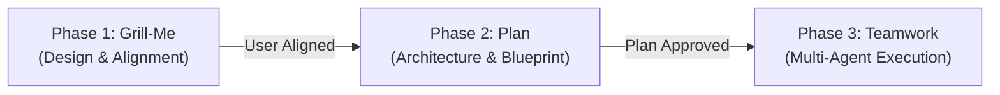

# Agent Rules: Grill-Plan-Team Workflow

This repository enforces the **Grill-Me $\to$ Plan $\to$ Teamwork-Preview** 3-phase development workflow. All agent operations must strictly adhere to these gated phases. **Do not skip or blend phases.**

---

## Strict Phase Governance

### 1. Phase 1: Interactive Alignment (Grill-Me)
- **Goal**: Resolve all technical, UX, and architectural decisions before writing any code or plans.
- **Rule 1 — One Question at a Time**: Use interactive questions (`ask_question` tool where available, or focused multiple-choice prompts) to present clear, structured options. Never overwhelm the user with lists of unstructured questions.
- **Rule 2 — Explore Codebase First**: Search existing code, configs, patterns, and dependencies before asking. Adopt repository conventions instead of asking obvious questions.
- **Rule 3 — Always Recommend**: Prefix your chosen option with `(Recommended)` and provide a concise engineering rationale.
- **Rule 4 — Walk the Design Tree**: Resolve decisions systematically: Data models $\to$ API contract $\to$ State/Storage $\to$ CLI/UI surface $\to$ Edge cases.
- **Phase Gate**: Phase 1 completes ONLY when all architectural tradeoffs, scope boundaries, and edge cases are agreed upon.

### 2. Phase 2: Technical Design & Verification (Plan)
- **Goal**: Translate the agreed design into a rigorous, actionable engineering blueprint.
- **Rule 1 — Deep Feasibility Exploration**: Inspect all imports, types, schemas, and existing tests to ensure 100% feasibility.
- **Rule 2 — Create Implementation Plan Artifact**: Write an implementation plan artifact at `<Artifact Directory>/<feature>_implementation_plan.md` containing:
  - **Goal Description**: 1–2 sentence problem statement and desired end-state.
  - **User Review Required**: Critical breaking changes or architectural constraints agreed in Phase 1.
  - **Proposed Changes**: Files to create, modify, or delete, grouped by component/layer with code snippets and diffs.
  - **Verification Plan**: Objective, programmatic verification steps (exact test commands, type checking, build commands, E2E scripts).
- **Phase Gate Approval**: Present the plan to the user. **DO NOT proceed to execution or Phase 3 until the user explicitly approves the plan.**

### 3. Phase 3: Multi-Agent Swarm Handoff (Teamwork Preview)
- **Goal**: Package the approved blueprint into a high-leverage specification and delegate execution to the autonomous `teamwork_preview` multi-agent swarm.
- **Rule 1 — Maintain Prompt Draft Artifact**: Write `<Artifact Directory>/prompt_draft.md` with:
  - Status (`Ready for launch — awaiting user approval`)
  - Project description
  - Working directory & integrity mode
  - Behavioral Requirements (R1, R2, ...)
  - Objective, programmatic Acceptance Criteria with checkboxes
- **Rule 2 — Teamwork Principles**: Specify *what*, not *how*. Provide programmatic verification commands. Avoid micromanaging implementation details.
- **Rule 3 — Delegation Protocol**: Once the user confirms ("launch", "go", "approved"), update status to `Launched`, extract the prompt, and invoke the autonomous multi-agent swarm (`invoke_subagent` with `TypeName: teamwork_preview`).
