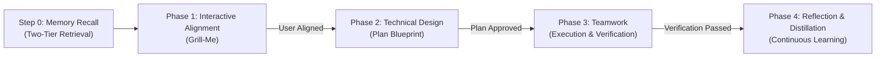

# Agent Rules: Grill-Plan-Team Workflow

This repository enforces the **Grill-Me $\to$ Plan $\to$ Teamwork $\to$ Distill** workflow backed by a two-tier recursive memory architecture. All agent operations must strictly adhere to these gated phases. **Do not skip or blend phases.**

---

## Strict Phase Governance

### 0. Step 0: Memory Recall (Pre-Flight Context)
- **Goal**: Ingest user and project context before any interview questions are asked.
- **Rule 1 — Developer Assessment**: Read `.grill-plan-team/ASSESSMENT.md` (Project Local) or `~/.config/grill-plan-team/ASSESSMENT.md` (User Global) for developer persona, job role, AI experience level, and collaboration preferences.
- **Rule 2 — Requirements & Guardrails**: Read `.grill-plan-team/REQUIREMENTS.md` (Project Local) or `~/.config/grill-plan-team/REQUIREMENTS.md` (User Global) for technical guardrails, VCS workflows (`gh`, `git`, GitLab, Bitbucket), stack preferences, past ADRs, and reviewer lessons.

### 1. Phase 1: Interactive Alignment (Grill-Me)
- **Goal**: Resolve all technical, UX, and architectural decisions before writing any code or plans.
- **Rule 0 — Baseline Assessment Onboarding**: If baseline documents are missing or if the user requests a reset (`re-assess`, `update preferences`), prompt for scope choice (User Global vs Project Local), developer role & AI experience, and guardrails/VCS/stack rules, then initialize `ASSESSMENT.md` and `REQUIREMENTS.md`.
- **Rule 1 — Adaptive Memory Recall**: Skip trivial questions already resolved by memory.
- **Rule 2 — One Question at a Time**: Use interactive questions (`ask_question` tool where available, or focused multiple-choice prompts) to present clear, structured options. Keep options concise. Never overwhelm the user with lists of unstructured questions.
- **Rule 3 — Explore Codebase First**: Search existing code, configs, patterns, and dependencies before asking. Adopt repository conventions instead of asking obvious questions.
- **Rule 4 — Always Recommend with Attribution**: Prefix your chosen option with `(Recommended)` and provide a concise engineering rationale, explicitly noting when derived from user or project memory.
- **Rule 5 — Walk the Design Tree**: Resolve decisions systematically: Data models $\to$ API contract $\to$ State/Storage $\to$ CLI/UI surface $\to$ Edge cases.
- **Phase Gate**: Phase 1 completes ONLY when all architectural tradeoffs, scope boundaries, and edge cases are agreed upon.

### 2. Phase 2: Technical Design & Verification (Plan)
- **Goal**: Translate the agreed design into a rigorous, actionable engineering blueprint.
- **Rule 1 — Deep Feasibility & Memory Grounding**: Inspect all imports, types, schemas, and existing tests to ensure 100% feasibility. Ground the blueprint in project conventions and past architectural decisions.
- **Rule 2 — Create Implementation Plan Artifact**: Write an implementation plan artifact at `<Artifact Directory>/<feature>_implementation_plan.md` containing:
  - **Goal Description**: 1–2 sentence problem statement and desired end-state.
  - **User Review Required**: Critical breaking changes or architectural constraints agreed in Phase 1.
  - **Proposed Changes**: Files to create, modify, or delete, grouped by component/layer with code snippets and diffs.
  - **Verification Plan**: Objective, programmatic verification steps (exact test commands, type checking, build commands, E2E scripts).
- **Phase Gate Approval**: Present the plan to the user. **DO NOT proceed to execution or Phase 3 until the user explicitly approves the plan.**

### 3. Phase 3: Teamwork Execution & Verification
- **Goal**: Package the approved blueprint into a high-leverage specification and execute autonomously with programmatic verification.
- **Rule 1 — Maintain Prompt Draft Artifact**: Write `<Artifact Directory>/prompt_draft.md` with:
  - Status (`Ready for launch — awaiting user approval`)
  - Project description
  - Working directory & integrity mode
  - Behavioral Requirements (R1, R2, ...)
  - Objective, programmatic Acceptance Criteria with checkboxes
- **Rule 2 — Teamwork Principles**: Specify *what*, not *how*. Provide programmatic verification commands. Avoid micromanaging implementation details.
- **Rule 3 — Universal Execution Protocol**: Once the user confirms ("launch", "go", "approved"), update status to `Launched`, extract the prompt, and execute. In multi-agent harnesses supporting subagent tools (like `invoke_subagent`), delegate to an autonomous subagent (`TypeName: "self"`). On single-agent harnesses, execute the plan directly as the lead orchestrator.

### 4. Phase 4: Reflection & Distillation Loop
- **Goal**: Persist learnings from interview choices, architectural outcomes, and test results into `ASSESSMENT.md` and `REQUIREMENTS.md`.
- **Rule 1 — User Assessment Distillation**: Record developer interaction preferences and tool feedback in `ASSESSMENT.md` under `## Distilled User Preferences`.
- **Rule 2 — Architectural Records**: Append new decisions to `REQUIREMENTS.md` under `## Architectural Decision History`.
- **Rule 3 — Preventative Lessons**: Record test failures, edge case fixes, and reviewer feedback under `## Past Pitfalls & Reviewer Lessons` in `REQUIREMENTS.md`.
- **Rule 4 — Anti-Bloat**: Enforce concise, deduplicated bullet points.
