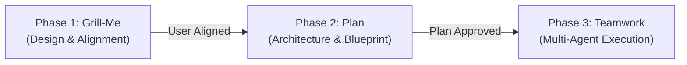

# Grill-Me $\to$ Plan $\to$ Teamwork-Preview Pipeline

Execute project development across three strictly gated, sequential phases. **Do not skip or blend phases.** Each phase acts as a prerequisite gate for the subsequent phase.



---

## Phase 1: Interactive Alignment (Grill-Me)

Conduct a targeted interview with the user to explore and resolve all technical, UX, and architectural decisions before writing any code or plans.

### Execution Rules:
1. **One Question at a Time**:
   - Use the `ask_question` tool for every decision to present structured, clickable multiple-choice options.
   - Never dump multiple separate questions in a single response unless they are grouped in an atomic `ask_question` call.
2. **Explore the Codebase First**:
   - Before asking a question, search the codebase (using `view_file`, `run_command`, etc.). If existing conventions, configs, or patterns provide the answer, adopt them instead of asking trivial questions.
3. **Always Recommend**:
   - Provide your recommended choice for each question, prefixed with `(Recommended)` and accompanied by a concise engineering rationale.
4. **Walk the Design Tree**:
   - Resolve decisions branch-by-branch (e.g., Data models $\to$ API contract $\to$ State/Storage $\to$ UI/CLI surface $\to$ Edge cases).
5. **Phase Gate Completion**:
   - Phase 1 concludes only when all dependencies, edge cases, scope boundaries, and architectural tradeoffs have been agreed upon.

---

## Phase 2: Technical Design & Verification (Plan)

Translate the agreed design into a rigorous, actionable engineering blueprint.

### Execution Rules:
1. **Deep Codebase Exploration**:
   - Inspect all relevant files, imports, types, database schemas, and existing test suites to ensure 100% feasibility.
2. **Create Implementation Plan Artifact**:
   - Create an implementation plan artifact at `<Artifact Directory>/<feature>_implementation_plan.md` using `write_to_file` with:
     ```json
     {
       "ArtifactMetadata": {
         "RequestFeedback": true,
         "Summary": "Technical design plan and verification strategy for <feature>",
         "UserFacing": true
       }
     }
     ```
   - Structure the plan with:
     - **Goal Description**: 1–2 sentence problem statement and desired end-state.
     - **User Review Required**: Critical breaking changes or architectural constraints agreed in Phase 1.
     - **Proposed Changes**: Files to create, modify, or delete, grouped by component/layer with code snippets and diffs.
     - **Verification Plan**: Objective, programmatic verification steps (e.g., exact test commands, `tsc --noEmit`, build commands, or E2E scripts).
3. **Phase Gate Approval**:
   - Present the plan artifact link to the user.
   - **Do not proceed to execution or Phase 3 until the user explicitly approves the plan** (e.g., "looks good", "approved", "proceed").

---

## Phase 3: Multi-Agent Swarm Handoff (Teamwork Preview)

Package the approved blueprint into a high-leverage specification and delegate execution to the autonomous `teamwork_preview` multi-agent swarm.

### Execution Rules:

#### 1. Maintain the Prompt Draft Artifact
Create and update `prompt_draft.md` in the artifact directory (`<Artifact Directory>/prompt_draft.md`) using this structure:

```markdown
# Teamwork Project Prompt — Draft

> Status: Ready for launch — awaiting user approval
> Goal: Craft prompt → get user approval → delegate to teamwork_preview
> Requested team: [none — teamwork routes from the description]

[Project description — 1-2 sentences]

Working directory: <Target absolute path>
Integrity mode: development

## Requirements

### R1. [Primary Deliverable]
[What to build, focus on behavior and interfaces]

### R2. [Secondary Deliverable / Constraint]
...

## Acceptance Criteria

### [Verification Category]
- [ ] [Objective, programmatic condition: e.g. test command passes with zero errors]
- [ ] [Strict type checking passes: e.g. npx tsc --noEmit]
- [ ] [Build passes: e.g. npm run build]
- [ ] [Git governance: e.g. work committed only to local branch, zero pushes/deploys]

---
*Next: when approved → delegate via invoke_subagent*
```

#### 2. Adhere to Teamwork Principles
- **Specify What, Not How**: Define clear interfaces, behaviors, and acceptance criteria. Avoid over-constraining the agent team with rigid implementation micro-steps unless the user specifically requested them.
- **Objective Verification**: Provide programmatic verification commands that prevent the team from prematurely self-certifying work.
- **Minimal Requirements**: Only specify constraints the user genuinely cares about, leaving room for the agents' independent problem-solving.

#### 3. Delegation Protocol
Once the user confirms ("launch", "go", "looks good"):
1. Update `prompt_draft.md` status to `> Status: Launched`.
2. Extract the complete text from `prompt_draft.md`.
3. Invoke the autonomous multi-agent teamwork system using `invoke_subagent`:
   ```json
   {
     "Subagents": [
       {
         "TypeName": "teamwork_preview",
         "Role": "Teamwork Orchestrator",
         "Prompt": "<Full prompt text extracted from prompt_draft.md>",
         "Model": "inherit"
       }
     ]
   }
   ```
4. Confirm to the user that the multi-agent team has been spawned with its conversation ID.
